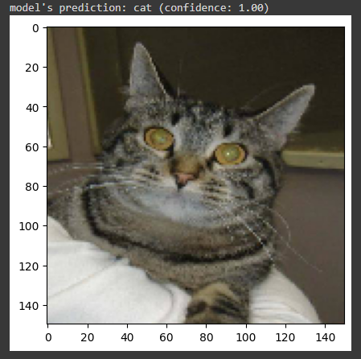
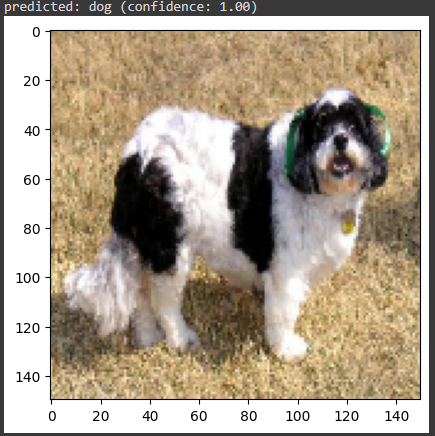
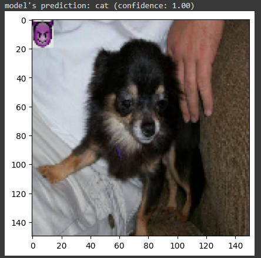

# Backdoor Attacks
In this project, we discuss backdoor attacks. Backdoor attacks are a form of adversarial attack on deep networks where the attacker provides poisoned data to the victim to train the model with.

## Data
We use dogs and cats dataset and an emojie as a trigger.We want our model to missclassify dog images as cat images if our dog images contain the trigger.
To create poisend data, we paste our trigger into the dog dataset and save them as cats.

## Model
We use Resnet18 as our training model.

## Results
A sample of results:
 

