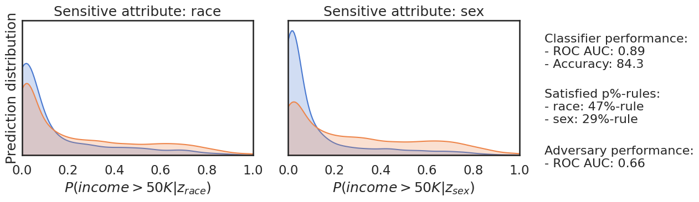
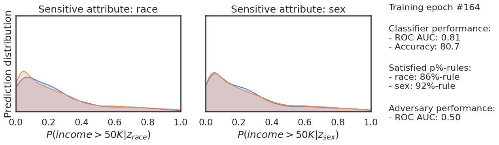

# Fairness

In this project, first we train a classifier to predict the level of people's income, then we train an adversary classifier to examine two
features are fair and don't have bias or not.

## Dataset
We use the adult.csv dataset for this purpose.

## Model
For the classifier, we use four linear layers and a ReLU activation function. After each layer, we use a dropout, and finally, a sigmoid for the last layer.

## Adversary model
In this part, we examine two sensitive features, including sex and race. For this purpose, we define a network with a predicted level of income as input, sex and race as output.

## Result
A sample of result:
 

 
## Train a fair classifer
As we can see, the features are not fair. To solve this issue, we use a loss function that includes two terms:
1'st term: tries to predict the right class.
2nd term: tries to make features fair.
 
## Result of fair classifer:
A sample of results of this training:
 

## Conclusion

 |   Classifier      | ROC AUC Classifier | Accuracy Classifier | P% rules for race | P% rules for sex | Adversary AUC ROC|
 |-------------------|--------------------|---------------------|-------------------|------------------|------------------|
 | Unfair Classifier |       0.89         |         84.3        |         47%       |        29%       |        0.66      |
 | Fair Classifier   |       0.81         |         80.7        |         86%       |        92%       |        0.5       | 

