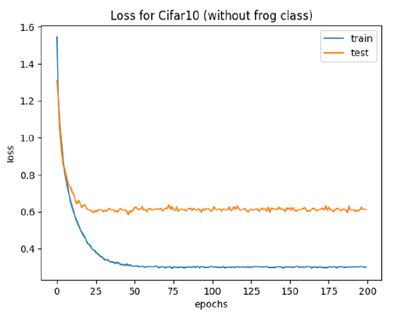
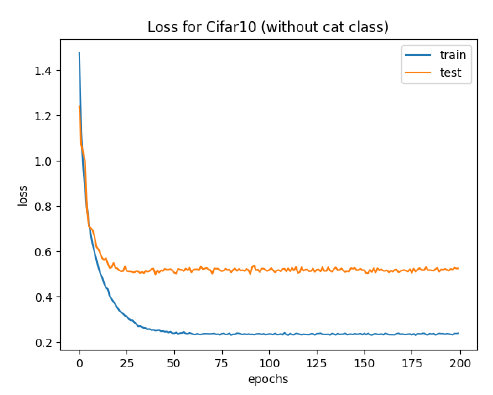

# Out of distribution detection
In this project we discuss about outliers, we set a threshold, if output of a softmax below that threshold, is considerd as outlier.

## Model
We use torchvision resnet18. For detect outliers, we train our model two times:
- Train a classifier without frog class
- Train a classifier without cat class

 
We can see the training loss below:
  
## Result
A sample of result:

 

